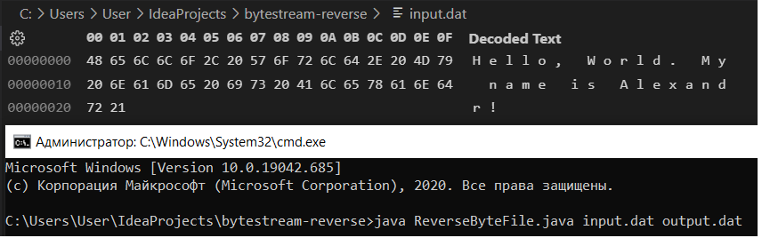
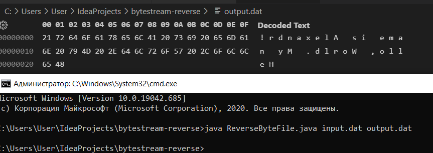

# Reverse byte file with Java implementation

This code implements reverse of bytes sequence in file.

## Requirements
* Java 19

## Run
```bash
java ReverseByteFile.java <input file path> <output file path>
```

# Examples
`input.dat:`

`output.dat:`

